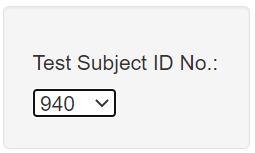
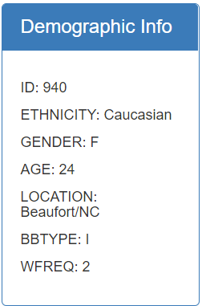
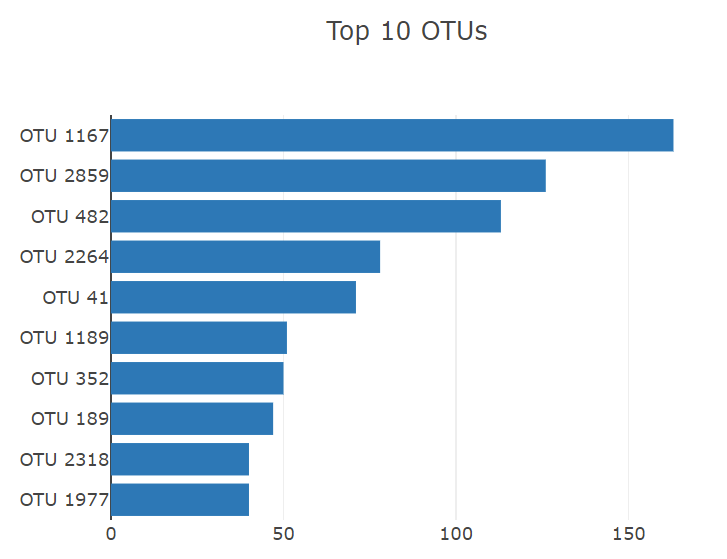
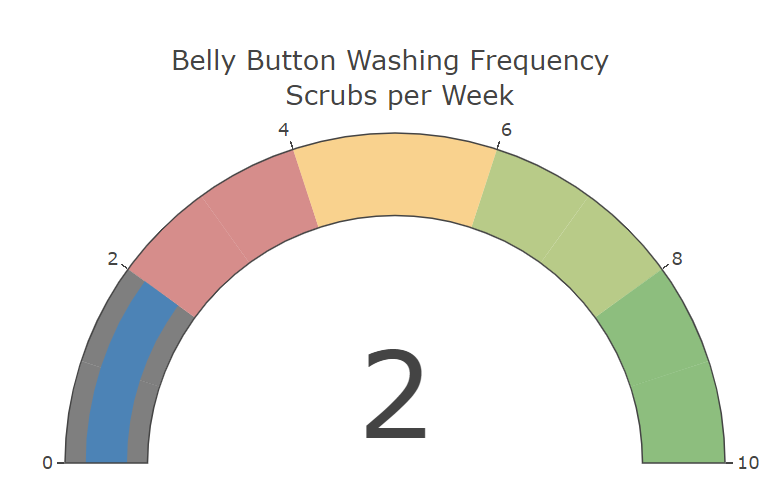

# plotlydiploy

The purpose of this repository is to use JavaScript, Plotly, and D3.js, to create a webpage on Bellybutton Biodiversity. The webpage shows multiple charts displaying various data based on the individual’s ID selected from the dropdown menu on a webpage.

Check out the website: https://robertaicenogle.github.io/plotlydiploy/

## To get started, select an ID:

### Updated ID Demographics

## A bar chart shows Top 10 OTUs for each ID:

## The gauge shows washes per week:

